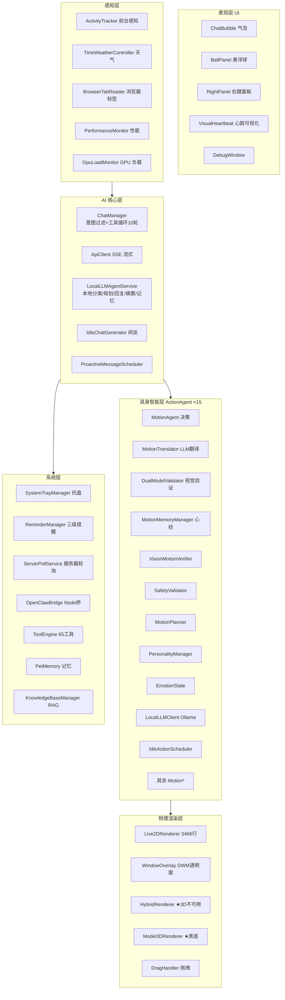

# 代码真相架构文档（Code-Truth Architecture）

> **审计方式**: 全部结论以 `code/desktop_unity/Assets/Scripts/` 下真实代码为准（2026-08-26 快照，含本地工具路由/运行时就绪检查、安装器相关迭代，以及此前 N39-N44 修复）
> **审计范围**: **119 个 .cs 文件**（2026-08-27 实测，含 Editor、Live2DFramework、ActionAgent、ActionPresets、ToolEngine 及 Preferences/TaskTemplate/TaskTrajectory 等）
> **重要声明**: 本项目的 md 文档（README / docs / 各类方案文档）**部分已过时**，存在多处与代码不符的陈述。本文档即为"唯一可信"的架构参照。
> **引擎**: 团结引擎 Tuanjie 2022.3.62t7（Unity 派生版）+ Live2D Cubism SDK 5-r.4
> **版本基准**: N38 审计（2026-08-02）→ N39 代码修复（2026-08-02）→ N40 Token 优化（2026-08-07，T1-T8 全部完成）→ 2026-08-12 任务可视化/审批/并行化/65 工具 → N41/N42（像素表情、搜索/日志修复）→ 2026-08-17~22 外置窗口、输入、模型路由与安装包迭代 → 2026-08-25 LaTeX/PDF/本地模型保护 → 2026-08-27 当前工作区审计

---

## 一、目录结构真相（非文档所述）

### 1.1 代码布局（真实）

```
code/desktop_unity/Assets/
├── Scripts/                          # 主控与系统层（61 个 .cs 顶层文件）
│   ├── Editor/                       # 编辑器工具（6 个，非运行时）
│   ├── Live2DFramework/              # Live2D 参数框架（8 个 .cs：ParameterMapper/ModelAnalyzer 等）
│   │   └── ActionAgent/              # 具身动作闭环（15 个文件，AutoMotionCollector 已于 N39 删除）
│   └── ToolEngine/                   # 工具系统（20 个 .cs = 12 个工具文件 + 7 个基础设施 + 1 测试器，65 个工具）
├── StreamingAssets/Live2D/Fuxuan/    # 符玄 Live2D 模型（唯一模型）
└── Resources/                        # 运行时资源
```

> **实测统计（2026-08-27）**: 顶层 Scripts 66 + Editor 6 + Live2DFramework 8 + ActionAgent 15 + ActionPresets 6 + ToolEngine 20 = **121 个 .cs 文件**。

### 1.2 文件规模 TOP 榜（按行数）

| 文件 | 行数 | 职责 |
|---|---|---|
| `Scripts/Live2DRenderer.cs` | **3,930** | Live2D 模型加载、参数、动作与交互逻辑 |
| `Scripts/Live2DRenderer.OverlayRendering.cs` | **144** | Live2D 置顶叠加相机、RenderTexture、OnGUI 与性能档位 |
| `RightPanel.cs` | **2,530** | 右键面板主逻辑；聊天区和子面板已拆到 partial 文件 |
| `ChatManager.cs` | **1,889** | AI 请求协程、历史裁剪与回复收尾 |
| `ChatManager.RequestLifecycle.cs` | **120** | ChatManager 请求发送、排队、取消、状态通知与意图分类入口 |
| `ChatManager.ContextBuilder.cs` | **144** | ChatManager SystemPrompt 上下文注入与预算截断 |
| `ChatManager.ToolLoop.cs` | **283** | ChatManager 工具回环、审批、执行、结果压缩与历史写回 |
| `ChatManager.ReplyFinalizer.cs` | **18** | ChatManager 最终回复发布与逐句队列触发 |
| `Editor/ParameterVisionScanner.cs` | 1,851 | 编辑器：参数视觉扫描 |
| `ExternalChatWindow.cs` | **1,488** | 外置 Win32 窗口、DPI、输入和生命周期 |
| `DesktopPet.cs` | **1,408** | 主控制器、状态机、日志镜像 |
| `Live2DFramework/ActionAgent/MotionAgent.cs` | **1,333** | 动作决策智能体 |
| `Editor/VisualActionTester.cs` | 1,246 | 编辑器：视觉动作测试 |
| `Editor/SelfTrainingManager.cs` | 1,183 | 编辑器：自训练 |
| `Editor/Live2DParameterVerifier.cs` | 1,135 | 编辑器：参数验证 |
| `Live2DFramework/Live2DMotionTemplates.cs` | 1,052 | 动作模板集 |
| `Live2DFramework/ActionAgent/MotionTranslator.cs` | **1,046** | LLM 动作翻译器 |
| `ToolEngine/ToolHelpers.cs` | 960 | 工具辅助函数 |
| `Live2DFramework/ActionAgent/DualModelValidator.cs` | 913 | 视觉验证（实为单模型 GLM-4V） |
| `SystemTrayManager.cs` | 868 | 托盘、自启、剪贴板监听 |
| `ActivityTracker.cs` | **845** | 前台活动追踪 |

---

## 二、六层架构（以代码验证为准）

> 与 README 声称的六层架构大体吻合，但**各层内部组件数量与文档有出入**。



---

## 三、AI 核心层真相

### 3.1 ChatManager（2,454 行，主文件 1,889 + RequestLifecycle 120 + ContextBuilder 144 + ToolLoop 283 + ReplyFinalizer 18）— 与文档差异显著

| 项 | README 声称 | **代码实际** |
|---|---|---|
| 工具循环上限 | 5 轮 | **`MAX_TOOL_ROUNDS = 10`**（注释"5->10: 复杂任务需多轮"） |
| 历史裁剪 | — | **`MAX_HISTORY_ENTRIES = 60`** 条 |
| API 超时 | — | **看门狗 600s**（`REQUEST_TIMEOUT`，覆盖 GLM-4V 180s） |
| API 自动重试 | — | 最多 **3 次**，400/401/403 **不重试**（`ShouldRetry`） |
| 意图过滤 | — | **`IntentToolMap`**：chat/emotion 不发 tools；command/knowledge/operation 各配不同工具白名单 |
| 消息队列 | — | `_messageQueue` 等待时输入排队不丢 |
| 句子显示 | — | 流式 + 逐句队列（2.5s/句）、`SentenceVersionId` 供 ContextMenu 重播 |
| 反射（Reflect） | 声称驱动 | **已接线（N39 确认）**：`SendRequestCoroutine → CheckReflection → DoReflection（DeepSeek 提炼）→ CommitReflection`；曾有的 `OnReflectRequest` 死回调已删除 |
| Token 优化（N40） | — | **T1-T8 全部完成**：时间戳挪尾部（缓存命中 98.6%）、body schema 裁剪、max_tokens:1200+thinking 禁用、工具子集 65→27、历史 15000 字符预算、SystemPrompt 5012→2972、Speculative Multi-Action、usage 日志 |

### 3.1.1 工具子集（T4）与测试模式

- **`BuildToolSubsetForRound()`**（N40 T4）：首轮有意图 → 意图候选子集（27 个）；首轮无意图 → 纯对话（不发 tools）；后续回环 → 已用工具 ∪ 意图候选 ∪ `CoreToolSubset`
- **`CoreToolSubset`** = {play_action, set_expression, stop_action, generate_motion, get_system_info, get_mouse_pos}
- **`InjectMultiActionCapability()`**（N40 T7）：一次预测 2-3 步工具调用（UFO² Speculative Multi-Action）
- **`IsTestMode`**：存在 `D:\DesktopPetData\.test_mode` 标记文件时为测试模式（跳过睡眠判断等）
- **`DeveloperCommandSet`**：桌宠本地开发指令唯一入口；支持 `/mode set test`、`/mode set normality`、`/tell mode`，在 `ChatManager` 写历史/启动 LLM 前处理，回执只进入当前 UI 动态日志
- **`HISTORY_CHAR_BUDGET = 15000`**（N40 T5）+ 旧消息 Ollama 本地摘要【旧事纪要】

### 3.2 系统 Prompt 注入链（真实）

`ChatManager.ContextBuilder.cs` 中的 `BuildSystemPrompt()` 实际注入（按序）：
1. 基础人格（符玄人设）
2. `ActivityTracker.GetSummary()` 活动摘要
3. ★ 当前前台窗口（法眼实时观测）
4. ★ 多窗口环境摘要 `GetVisibleWindowsSummary()`
5. ★ 浏览器标签页深度感知 `GetBrowserTabsSummary()`
6. `InjectParameterKnowledge()` → **`ParameterKnowledgeProvider.GenerateKnowledgePrompt()`**（身体参数知识）
7. `InjectClosedLoopCapability()` → 闭环演武系统说明（GLM-4V 自评、演武心经、30 上限、无望淘汰）
8. `MotionMemoryManager.GetFormattedMemories()` 演武心经经验

### 3.3 本地 LLM 能力（LocalLLMAgentService）

本地能力分层运行于 Ollama（动作/规划/摘要/记忆默认 `qwen2.5:3b`，聊天默认 `qwen3:8b`，`http://127.0.0.1:11434`）：
- `ClassifyIntent` — 本地意图/情绪分类（异步，不阻塞对话流，写入 `_lastIntent` 供工具过滤）
- `PlanLocalTool` — 按意图小目录输出 JSON 工具计划，由 `ChatManager` 校验后复用 `ToolEngine`
- `GenerateFallbackReply` — 本地角色回复，结合相关忆境和已执行工具结果
- `SummarizeConversation` — 对话摘要
- `ExtractMemory` — 记忆提取

> ★ 注意：`LocalLLMClient.cs` 是**手写 JSON 构造**（非 Newtonsoft/JsonUtility），重试 2 次。

---

## 四、工具系统真相（ToolEngine）— 文档严重过时

### 4.1 文件清单（20 个 .cs = 12 个工具文件 + 7 个基础设施 + 1 测试器）

| 文件 | 内容 |
|---|---|
| `WebSystemTools.cs` | **14 个**：search_web / open_url / search / open_app / open_folder / get_system_info / lock_screen / set_volume / mute / get_mouse_pos / list_files / notify / run_command / power |
| `ClipboardFileTools.cs` | **14 个**：get_clipboard / set_clipboard / get_weather / file_open / file_move / file_copy / file_delete / file_rename / file_info / file_create / dir_create / file_read / search_files / search_file |
| `ReminderAcademicTools.cs` | **8 个**：set_reminder / query_reminders / mark_reminder_done / delete_reminder / query_exams / query_scores / query_schedule / query_user_status |
| `Live2DSyncTools.cs` | **7 个**：set_expression / play_action / stop_action / inspect_motion_memory / inspect_personality / explore_body / control_body |
| `VisionKnowledgeTools.cs` | **5 个**：take_screenshot / knowledge_search / knowledge_index / openclaw_search / **openclaw_task**（太卜神行法，任务外包 + 审批 + 轨迹） |
| `MotionCoroutineTools.cs` | **5 个**：generate_motion / explore_body_vision / run_verification / vis_verify / self_review |
| `OfficeTools.cs` ★P1 补录 | **3 个**：generate_ppt / generate_docx / generate_xlsx（经 OpenClawBridge `/generate_office`） |
| `PreferenceTools.cs` ★P4 新增 | **3 个**：set_preference / query_preferences / remove_preference（PreferencesManager 配套） |
| `TaskTemplateTools.cs` ★P5 新增 | **3 个**：query_task_templates / save_task_template / remove_task_template（TaskTemplateManager 配套） |
| `PoggetTool.cs` ★文档未列 | **launch_pogget** → 启动 `d:\pogget\Pogget.exe` |
| `PoggetAgentTool.cs` ★文档未列 | **pogget_agent** → IPC 调 `D:\pogget\agent\bin\PoggetAgent-debug.exe`（**8 个子命令**：ping / list_containers / get_container_items / add_to_container / remove_from_container / create_container / organize_desktop / **quickpanel_status**） |
| `LatexCompileTool.cs` ★文档未列 | **compile_latex** → OpenClawBridge.CompileLatexAsync，输出 `D:\DesktopPetData\Documents\` |
| `AsyncToolBase.cs` | 异步工具基类（含 `ToolName` 虚属性，`search_web` 等 override 于此） |
| `IPetTool.cs` | 工具接口（ToolName / ToolDescription / ToolParametersJson / IsAsync / Execute / ExecuteAsync） |
| `ToolRegistry.cs` | 反射自动发现 IPetTool（AppDomain.GetAssemblies）；DangerousTools = {file_delete, power, lock_screen, run_command, set_volume, mute, **openclaw_task**} |
| `ToolSchema.cs` | JSON Schema 构建器 |
| `ToolHelpers.cs` | 工具辅助函数 |
| `ToolConfirmManager.cs` | 危险工具确认管理 |
| `GlmModels.cs` | GLM 模型配置 |
| `ToolBenchmarkRunner.cs` | 测试器（非运行时工具，全量稳定性测试用） |

> **合计：65 个已注册工具**（12 个工具文件；README 未提及 Pogget、LaTeX、Office、偏好、任务模板等新工具）。
> **注意**：`get_time`、`get_memories`、`write_memory`、`start_conversation` 等旧文档列出的工具在代码中**不存在**。
> **工具清单权威参照**：逐工具签名 / 参数 / 审批配置见 [`docs/modules/tool-engine.md`](modules/tool-engine.md)（与本文档 2026-08-13 同步核对）。
>
> 📚 **knowledge_index 支持 PDF（2026-08-15）**：`indexExtensions` 含 `.pdf`。链路：`KnowledgeBaseManager.IndexFile` → `OpenClawBridge.ExtractPdfTextAsync`（桥接 `/extract_pdf`）→ Python `scripts/knowledge/pdf_extract.py`（PyMuPDF 优先 / pypdf 兜底）→ 标准分块嵌入。扫描版 PDF 返回 `is_scanned:true` 提示 OCR。详见 [`docs/modules/bridge-communication.md`](modules/bridge-communication.md) §2.3 与 [`docs/modules/tool-engine.md`](modules/tool-engine.md) §2.2。

### 4.2 意图 → 工具白名单映射（真实）

- **chat** / **emotion** → 不发任何 tools（纯角色对话）
- **command** → launch_pogget、pogget_agent、open_app、open_url、open_folder、search、search_web、openclaw_search、**openclaw_task**、lock_screen、set_volume、mute、power、get_system_info、get_mouse_pos、list_files、run_command、notify、get_clipboard、set_clipboard、file_*、take_screenshot
- **knowledge** → search_web、search、openclaw_search、**openclaw_task**、knowledge_search、compile_latex、get_weather、**generate_ppt / generate_docx / generate_xlsx**、query_*、inspect_*、explore_body*
- **operation** → set_expression、play_action、stop_action、generate_motion、inspect_*、explore_body*、take_screenshot、knowledge_index

---

## 五、具身智能层（ActionAgent，15 个文件）真相

> README 声称"15 组件 / 15 文件"——N38 审计为 **16 个文件**，N39 删除 `AutoMotionCollector.cs` 后为 **15 个文件**（VisionMotionVerifier / SafetyValidator / PersonalityManager / MotionVerifier / MotionTranslator / MotionPlanner / MotionMemoryManager / MotionGenerator / MotionAgent / LocalLLMClient / IdleActionScheduler / GpuLoadMonitor / EmotionState / DualModelValidator / ActionReferenceManager）。

### 5.1 MotionAgent 决策循环（已核实与文档一致）

```
等待 → ShouldDecide() → GatherContext() → DecideWithLLM() / FallbackDecide()
     → ExecuteDecision() → 播放动作 → 回到等待
```

- **密度分级**：High = `max(base×0.5, 4s)` / Med = base / Low = `min(base×2, 15s)` / Sleep = 30s
- **截图采样点**：{0.20, 0.40, 0.60, 0.80}，拼 2×2 拼图

### 5.2 已确认 Bug（代码真相审计核心产出）

| # | 位置 | 问题 | 影响 |
|---|---|---|---|
| **BUG-1** | `MotionAgent.cs` L369 | **`IsSleepTime()` 硬编码 `return false`**（debug 跳过注释未删） | 睡眠时段密度永远不触发 |
| **BUG-2** | `MotionAgent.cs` | `ExecuteMotion` 在播放**前**加 AI 锁（L985），`ExecuteCombo` 在播放**后**加锁（L1062） | 锁序不一致，连招期间 AI 可能插话 |
| **BUG-3** | `MotionAgent.cs` | `GatherContext()` 注释声称农历→月相，实际用 `now.Day`（公历） | 月相感知名不符实 |
| **BUG-4** | `ActivityTracker.cs` | `UpdateInteractionTime()` 分支为空实现 | 交互时间未更新 |
| **BUG-5** | `DualModelValidator.cs` | **名为"Dual"实为单 GLM-4V**（Qwen-VL 已移除，qwenScore/review 恒 0） | 双模型校验名存实亡 |
| **BUG-6** | `AutoMotionCollector.cs` | `[Obsolete]` 死代码 331 行（已被 MotionAgent+DualModelValidator 取代但未删） | 维护负担 |
| **BUG-7** | `MotionTranslator.cs` | 示例（L242-256）用 `arm_right_upper: 0.8`，与规则"15-25 度"矛盾 | 可能误导 LLM 输出 |
| **BUG-8** | `MotionTranslator.cs` | README 称"11 规则+12 特殊模式"，**实际 10 规则 + 10 特殊模式（9 种姿势，捂脸重复）** | 文档错误 |
| **BUG-9** | `MotionPlanner.cs` | README 称曲线含 "BounceEaseOut"，实际为 `Bounce` | 文档错误 |

> **修复状态（N39, 2026-08-02）**：BUG-1~BUG-7 已在代码中修复（详见 `CHANGELOG.md` N39 条目），`build.ps1 -Quick` 编译验证通过。
> BUG-8/BUG-9 为纯文档错误，已随 N38 文档重写修正。
> **审计澄清**：#9（反思）与 #8（知识库）在修复前即已通过其他路径接线——
> 反思：`ChatManager.SendRequestCoroutine → CheckReflection → DoReflection → CommitReflection`（DeepSeek 提炼）；
> 知识库：`BackgroundKnowledgeSearch → SearchAndFormat → _cachedKnowledgeContext → SystemPrompt 注入`。
> 遗留的 `OnReflectRequest` 死字段与 `GetFormattedContext()` 恒空 STUB 已清理（删除字段 / 改为返回 `LastFormattedContext` 缓存）。

### 5.3 真实组件行为

| 组件 | 真相 |
|---|---|
| `MotionMemoryManager` | 30 条上限、负面 ≤10、冷却 120s、≥5 次尝试且最佳 ≤2 → 无望淘汰；`GetFailurePenalty`（≤2→0.3 / 近3次均值≤2.0→0.4 / ≤2.5→0.7）；11 个中文名映射；存储 `motion_memory.json` |
| `MotionPlanner` | 静态类；**10 个硬编码动作模板** + 6 表情模板 + 6 曲线 |
| `PersonalityManager` | 五维特质（勤奋0.5/温暖0.6/活泼0.5/自信0.5/好奇0.6）+ 三维关系（信任0.3/亲密0.2/熟悉0.1）；learningRate=0.01；drift 0.002/帧；**`DriftTowardNeutral` 由 MotionAgent（L405）按帧调用**（此前审计认为无调用者，2026-08-14 复核已接线） |
| `VisionMotionVerifier` | 静态；10 个视觉测试；先 MotionPlanner 后 LLM fallback；55% 进度截图；GLM 超时 180s；**用付费 GlmVisionModel（无余额降级）** |
| `SafetyValidator` | 2 个互斥组、5 对对称肢体、极端值警告 |
| `EmotionState` | valence/arousal/warmth/energy；120s 半衰期衰减；7 种主导情绪 |
| `MotionVerifier`（非视觉） | 静态同步、**无 LLM**；5 控制 + 10 测试 + 4 边界；`SYMMETRY_PAIRS` 10 对 |
| `MotionGenerator` | 非 MonoBehaviour；Mathf.Lerp 插值；插入零帧 |
| `IdleActionScheduler` | JSON 配置驱动（`idle_actions.json`，**9 个动作** id 1-9：歪头/微笑/挑眉/星辉*/伸懒腰/委屈/法阵*/害羞/困惑，*为硬编码）；硬编码天气权重（夜晚微笑×0.3 / 雨哭×1.8 / 雪微笑×1.5） |
| `GpuLoadMonitor` | 游戏分类 → `LocalLLMClient.Paused = true`，30s 冷却 |
| ~~`AutoMotionCollector`~~ | **已于 N39 删除**（331 行 `[Obsolete]` 死代码 + .meta + DesktopPet 自动添加逻辑一并移除） |

---

## 六、感知 / 记忆 / 窗口系统真相（33 文件审计）

### 6.1 文档声称存在但代码不符/缺失（8 项，其中 2 项已于 N39 修复）

| 文档声称 | 代码真相 |
|---|---|
| `KnowledgeBaseManager.GetFormattedContext()` 提供同步上下文 | ~~是 STUB，恒返回 ""~~ → **已修复（N39）**：新增 `LastFormattedContext` 缓存，由协程 `SearchAndFormat` 填充，同步 API 返回最近检索结果 |
| `ChatManager.OnReflectRequest` 驱动反思 | ~~回调恒 null，反思未实际驱动~~ → **已修复（N39）**：反思经 `SendRequestCoroutine → CheckReflection → DoReflection → CommitReflection` 接线，死回调字段已删除 |
| `HybridRenderer` 3D 模式可用 | **3D 模式不可用** — TODO 注释，强制走 Live2D |
| `Model3DRenderer` 绿幕抠像（Color Key） | **实际设置纯黑背景**（黑色=透明，供 DWM 玻璃层抠像；代码注释已说明该设计，非矛盾，2026-08-14 澄清） |
| `VisualHeartbeat` 默认表情 "curious" | **实际默认 "surprise"** |
| README "36 个核心脚本" | **实际顶层 66 + 子目录 55（共 121 个 .cs，2026-08-27 实测）** |
| `PerformanceMonitor.GetResolutionScale()` 动态降分辨率 | **恒返回 1.0f**（仅帧率降级；代码注释：始终全分辨率，防放大马赛克——**有意设计**，2026-08-14 澄清） |
| `WindowOverlay.isMultiMonitor` 支持多屏 | **已真实实现（P4.4，2026-08-12）**：`SM_CXVIRTUALSCREEN` 差值法（`virtualW > w || virtualH > h`），供 AI 感知注入；主屏窗口定位仍用 `SM_CXSCREEN`（此前"恒 false"为过时结论） |

### 6.2 真实实现（已核实存在且可用）

| 系统 | 真相 |
|---|---|
| `ReminderManager` | **三级推送真实**：气泡 → PowerShell-WinRT Toast（AppId '符玄'）→ Server酱³（`https://sctapi.ft07.com/send/{key}`）；存 `reminders.json` |
| `ServerPollService` | localhost:3000；Bearer token（Inspector→`DESKTOP_TOKEN`→fallback）；考试提醒：前 3 天 19:00 + 考前 2h |
| `ActivityTracker` | 2s 轮询；8 类关键词匹配（coding/gaming/studying/browsing/entertainment/communication/idle/other）；30 天留存 `activity_log.json` |
| `TimeWeatherController` | **默认天气源 wttr.in（cityCode="Nanjing"）**，QWeather 可选；DeepSeek 生成 6 行天气文案；天气→表情联动在 `Live2DRenderer.Update()` 消费 |
| `PetMemory` | 存储 `entries+coreFacts+conversationSummary`；entries 按 durable/episodic/tool/reflection 四层配额治理，当前问题必须命中相关词元后最多注入 3 条，忆境段上限 1400 字符；核心事实最多注入 3 条 |
| `KnowledgeBaseManager` | 真实 RAG：Ollama `/api/embed` + nomic-embed-text + 余弦 TopK；存 `knowledge_base.json` |
| `VisualHeartbeat` | GDI `StretchBlt` 8×6 网格 |
| `AutoChat` | 监听 `DragHandler.OnPetClicked/OnDragEnded` → `*戳额头*`；混淆关键词 → `ForceAction("confuse")` |
| `ChatBubble` | 消息优先级 Low/Normal/High，高优先抢占 |
| `RightPanel` | `~` 键（BackQuote）打开；**含 Pogget 启动按钮** |
| `DragHandler` | 5 帧投掷缓冲；`eyeFollowDistance = 150` |
| `SystemTrayManager` | `Shell_NotifyIcon` + `HKCU\Run` 自启 |
| `MainThreadDispatcher` | ConcurrentQueue |
| `ChatConfig.cs` | 仅环境变量，**提供 .cs.example 模板**（防泄漏） |
| `ApiClient.cs` | SSE 流式 |
| `IdleChatGenerator` | 批量 `\|\|\|` 拼接；minCacheSize=4 / batchSize=10 / 冷却 180f |
| `ProactiveMessageScheduler` | 零 LLM 规则：编码 90min / 23:00 深夜 / 12、18 点用餐 / 游戏 120min |
| `GpuLoadMonitor` | 见 5.3 |

### 6.3 OpenClawBridge（Node.js，`openclaw_bridge.js`）

- HTTP 端口 **19876**：`/health`（免鉴权）、`/search`、`/task`（POST 提交任务）、`/task/{id}`（GET 轮询）、`/task/{id}/cancel`（取消）、`/task/{id}/approve`（审批回执）、`/compile_latex`、`/generate_office`（2026-08-12 起 `/task` 系列已实现并 E2E 打通）
- **exec 审批（2026-08-12）**：OpenClaw 侧 `exec.approval.resolve` RPC 回执，`decision` ∈ `allow-once / allow-always / deny`；pendingApproval 按 kind 分流（exec / plugin）；`tools.exec.mode=ask` 已配置，危险命令须用户审批
- WebSocket 网关：`ws://127.0.0.1:18789`
- **认证（N39 后改为环境变量）**：请求头 `x-bridge-token`，取值优先 `BRIDGE_TOKEN` 环境变量（系统级，64 字符），fallback `GATEWAY_TOKEN`；`GATEWAY_TOKEN` 自动从 `C:\Users\25295\.openclaw\openclaw.json` 读取（含 BOM strip）
- C# 侧 `OpenClawBridge.cs`：`BASE_URL = http://127.0.0.1:19876`，`BridgeToken` 同样读环境变量 `BRIDGE_TOKEN`（未配置则返回空串禁用鉴权并打 Warning）
- **进程管理**：PM2 管理（进程名 `openclaw-bridge`），`ecosystem.config.js` 配置
- **并行锁（N40 后重构）**：`requestChains = new Map()`（per-sessionKey 串行链，防止并发覆盖 waiter），180s 超时
- 会话 key：`agent:main:main`（任务走独立 sessionKey `agent:main:task-<id>`）
- 消费方：`OpenClawBridge.cs`（C# 侧）+ `LatexCompileTool` + `VisionKnowledgeTools.openclaw_search` / `openclaw_task` + `OfficeTools.generate_*`

---

## 七、数据持久化真相

> 默认根目录在 `DataPathConfig.cs`：**`D:\DesktopPetData\`**（唯一事实源；可由 `FU_XUAN_DATA` 覆盖；配置路径失效且默认目录已有数据时自动复用默认目录，避免重装产生第二份活动数据；2026-08-21 起扩展 `EnsureDataRoot`）。`LogsDir` / `DocumentsDir` / `TestModeFile` / `InboxFile` 子路径均从该根目录派生。

| 文件 | 用途 |
|---|---|
| `reminders.json` | 提醒持久化（ReminderManager） |
| `activity_log.json` | 前台活动日志（ActivityTracker，30 天留存） |
| `knowledge_base.json` | 本地知识库（KnowledgeBaseManager RAG） |
| `motion_memory.json` | 演武心经（MotionMemoryManager） |
| `Documents/` | LaTeX 编译输出（LatexCompileTool） |
| `.test_mode` | 测试模式标记文件（存在 = IsTestMode） |

| 文件 | 写入方 | 说明 |
|---|---|---|
| `pet_config.json` | PetConfig | 宠物配置 |
| `pet_memory.json` | PetMemory | 记忆（3 层结构） |
| `reminders.json` | ReminderManager | 提醒 |
| `motion_memory.json` | MotionMemoryManager | 演武心经（30 条上限） |
| `pet_personality.json` | PersonalityManager | 人格五维 |
| `activity_log.json` | ActivityTracker | 30 天活动日志 |
| `knowledge_base.json` | KnowledgeBaseManager | RAG 知识库 |
| `pet_preferences.json` ★P4 新增 | PreferencesManager | 用户偏好（set_preference/query_preferences/remove_preference） |
| `task_templates.json` ★P5 新增 | TaskTemplateManager | 任务模板（30 条上限，save/query/remove） |
| `task_trajectories.json` ★P5 新增 | TaskTrajectoryManager | 任务轨迹记录（openclaw_task 执行复盘） |
| `Documents/` | LatexCompileTool | LaTeX 编译输出 |
| `ActionRefs/` | ActionReferenceManager | 参考图（512×512 PNG 仅注释） |
| `glm_collages/` | DualModelValidator | 2×2 拼图（上限 50 张） |

---

## 八、构建与测试真相

| 项 | 真相 |
|---|---|
| 构建入口 | `Editor/BuildScript.cs`：`BuildDesktopPet()` / `VerifyCompile()` |
| 构建脚本 | `build.ps1`（`-Quick` / `-RunTests` / `-OutputDir`） |
| 构建产物 | `Build\DesktopPet.exe` |
| 引擎 | Tuanjie 2022.3.62t7（团结引擎）；**路径拼接 bug：需 `cd` 到项目目录 + `-projectPath .`** |
| 单元测试 | `Assets/Editor/Tests/` 当前测试文件与实际程序集为准；现有 `logs/build/test_results.xml` 记录 **2026-08-20 EditMode 114/114 全过**；注意 `Debug.LogError/Warning` 会被计为失败，需 `LogAssert.Expect`；该 XML 是历史产物，不代表当前工作区已重新执行测试 |

---

## 九、文档 vs 代码偏差总表（核心交付物）

> 状态列：N39 修复（2026-08-02）/ N40 更新（2026-08-07~08）/ 2026-08-12（P1/P4/P5 + 任务可视化）后统一标注。

| # | 文档陈述 | 代码真相 | 严重度 | 状态 |
|---|---|---|---|---|
| 1 | README 工具循环 5 轮 | `MAX_TOOL_ROUNDS=10` | 高 | ✅ 已修正 |
| 2 | ToolEngine 6 文件 | **12 工具文件 + 7 基础设施 + 1 测试器 · 65 工具（2026-08-12 全量清点）** | 高 | ✅ 已更新 |
| 3 | ActionAgent 15 组件 | **15 文件（N39 删除 AutoMotionCollector 后）** | 低 | ✅ 已更新 |
| 4 | "11 规则 + 12 特殊模式" | 10 规则 + 10 特殊（9 姿势） | 中 | ✅ 已修正 |
| 5 | 曲线含 "BounceEaseOut" | `Bounce`（共 6 种） | 低 | ✅ 已修正 |
| 6 | 双模型校验（Qwen+GLM） | 单 GLM-4V（Qwen 已删，N39 回调简化为 4 参） | 高 | ✅ 已修正 |
| 7 | 36 个核心脚本 | 顶层 66 + 子目录 55（实测 **121** 个 .cs，2026-08-27） | 中 | ✅ 已更新 |
| 8 | 知识库同步上下文 | ~~`GetFormattedContext()` 是 STUB~~ → **N39 已修复**（`LastFormattedContext` 缓存） | 高 | ✅ N39 已修复 |
| 9 | 反思机制驱动 | ~~`OnReflectRequest` 恒 null~~ → **N39 已接线**（CheckReflection → DoReflection → CommitReflection） | 高 | ✅ N39 已修复 |
| 10 | 3D 渲染可用 | HybridRenderer TODO，强制 Live2D | 中 | ⚠️ 保持现状（规划中） |
| 11 | 绿幕抠像 | 纯黑背景（黑色=透明，DWM 玻璃层） | 低 | ✅ 2026-08-14 注释已澄清 |
| 12 | 多屏支持 | `isMultiMonitor` 恒 false | 中 | ✅ P4.4 已实现（2026-08-12，`SM_CXVIRTUALSCREEN` 差值法） |
| 13 | 动态分辨率降级 | `GetResolutionScale` 恒 1.0 | 低 | ✅ 有意设计（防放大马赛克），文档已澄清 |
| 14 | 默认表情 curious | 默认 surprise | 低 | ✅ 已修正 |
| 15 | 天气来源（文档/记忆称 QWeather 主） | 默认 wttr.in，QWeather 可选 | 中 | ✅ 已修正 |
| 16 | AutoMotionCollector 活动采集 | ~~[Obsolete] 死代码 331 行~~ → **N39 已删除**（+ .meta + DesktopPet 自动添加逻辑） | 中 | ✅ N39 已删除 |

---

## 十、结论与建议

### 可信的架构骨架
六层架构、闭环演武（生成→摄形→GLM 自评→心经强化）、意图过滤工具系统、三级提醒、RAG 知识库、OpenClaw 桥接、Pogget/LaTeX 集成——**这些都是真实存在且可用的**。

### 最需要优先修复的 5 件事（N38 审计时点 · N39 已全部修复 ✅）
1. **BUG-1**：`IsSleepTime()` 恒 false → 睡眠调度失效 → ✅ N39 已修复（真实 1-7am + testMode）
2. **BUG-2**：`ExecuteCombo` 锁序错误 → 连招期间 AI 可能插话 → ✅ N39 已修复（锁时序统一）
3. **#9**：反思机制未接线（OnReflectRequest 恒 null） → ✅ N39 已接线（CheckReflection→DoReflection→CommitReflection）
4. **#8**：知识库同步上下文 STUB → ✅ N39 已修复（LastFormattedContext 缓存）
5. **BUG-5**：DualModelValidator 名不副实 → ✅ N39 已修复（回调简化 4 参，删除恒 0 qwenScore）

### 建议
- 以本文档为基准更新 README / docs 中的过时章节（**已完成**，2026-08-13 全量修订，含 65 工具 / /task 端点 / 新持久化文件）
- 清理死代码（AutoMotionCollector 已删）、修正注释与代码矛盾（Model3DRenderer、VisualHeartbeat）
- 跨屏行走策略与 3D 模式仍为规划中能力；`isMultiMonitor` 多屏检测已实现，勿把“检测能力”误写成“跨屏行走已完成”
