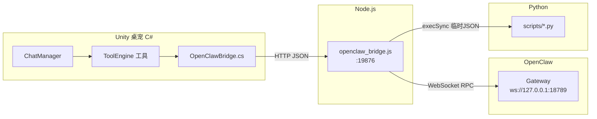

# 符玄桌宠 — 项目开发规范（Development Standards）

> **版本**: v1.0 (2026-08-12)
> **定位**: 本仓库**唯一权威开发规范**。所有组件通信、目录组织、测试、日志、Git 提交均以此为准。
> **读者**: 人类开发者 + AI 编码代理（GitHub Copilot / Claude Code 等）
> **配套**: 本文件为详细版；根目录 `AGENTS.md` 为 AI 快速入口（摘要+指针），两者内容保持一致，冲突时以本文件为准。
> **参照**: [Conventional Commits 1.0](https://www.conventionalcommits.org)、[Google Engineering Practices](https://google.github.io/eng-practices/)、[.NET Coding Conventions](https://learn.microsoft.com/dotnet/csharp/fundamentals/coding-style/coding-conventions)、[12-Factor 日志](https://12factor.net/zh_cn/logs)

---

## 目录

1. [总则](#一总则)
2. [组件通信规范](#二组件通信规范)
3. [文件夹管理规范](#三文件夹管理规范)
4. [代码风格规范](#四代码风格规范)
5. [Git 提交规范](#五git-提交规范)
6. [测试规范](#六测试规范)
7. [日志规范](#七日志规范)
8. [AI 协作规范](#八ai-协作规范)
9. [新增功能的标准流程](#九新增功能的标准流程)

---

## 一、总则

### 1.1 核心原则

| 原则 | 说明 |
|------|------|
| **代码即真相** | 一切以 `code/desktop_unity/Assets/Scripts/` 真实代码为准，文档过时须修正而非迁就 |
| **最小惊讶** | 新代码遵循已有模式（工具=AsyncToolBase、端点=现有 HTTP 风格），不做"独创" |
| **本地优先** | 能用本地工具解决的不用外部 AI；危险操作必须走审批 |
| **可验证** | 每个改动要有验证手段（编译 / 测试 / 端到端 curl） |
| **中文接口** | 面向桌宠的工具描述、用户可见消息用中文；代码标识符、日志键用英文 |

### 1.2 禁止事项

- ❌ 不要在测试中遍历调用所有工具（`lock_screen` 真锁屏、`file_delete` 真删文件）
- ❌ 不要在代码中硬编码密钥（一律走环境变量，模板用 `.cs.example`）
- ❌ 不要向用户/日志输出完整密钥或 Token
- ❌ 不要用 `Out-File -Encoding utf8` 直接写 JSON（PS 5.1 会写 BOM → Python 需 `utf-8-sig`）
- ❌ 不要 kill PM2 进程后手动启动桥接（会 EADDRINUSE，用 `pm2 restart`）

---

## 二、组件通信规范

### 2.1 总体架构



### 2.2 Unity C# → 桥接服务器（HTTP）

**唯一入口**: `OpenClawBridge.cs`（`static class`，所有对外 HTTP 都经它封装，禁止散落 `UnityWebRequest` 直接调用）。

| 项 | 约定 |
|----|------|
| 基础地址 | `http://127.0.0.1:19876`（常量 `BASE_URL`，不要用 localhost 之外的主机） |
| 鉴权头 | 每次请求带 `x-bridge-token: <BRIDGE_TOKEN>`（读环境变量，不硬编码） |
| Content-Type | POST JSON 一律 `application/json` |
| 编码 | 请求/响应体用 UTF-8 |
| 超时 | 搜索 180s / LaTeX 1800s / 办公 300s（按端点设置，留足余量） |
| 错误约定 | 失败必须返回 JSON：`{"success":false,"error":"..."}`；成功用端点自身 schema |
| 可用性 | 每次失败更新 `IsAvailable`/`LastError`，供工具层给出友好提示 |

**新增端点方法范式**（参考 `SearchWebAsync` / `CompileLatexAsync` / `GenerateOfficeAsync`）：
1. 静态方法，返回 `Task<string>`（JSON 文本）；
2. 参数校验在前（空输入直接返回 ❌ 消息，不发请求）；
3. `using` + `UnityWebRequest`，设 header/timeout；
4. `SendWebRequest` + `while (!op.isDone) await Task.Yield();`；
5. 成功返回**完整 raw JSON**（给工具层解析），失败返回 `{"success":false,"error":"..."}`。

### 2.3 桥接服务器端点（Node.js）

**文件**: `code/desktop_unity/openclaw_bridge.js`（PM2 管理，进程名 `openclaw-bridge`）。

| 端点 | 方法 | 鉴权 | 职责 |
|------|------|------|------|
| `/health` | GET | 免鉴权 | 健康检查，返回 `{"status":"ok","connected":true}` |
| `/search?q=` | GET | `x-bridge-token` | AI 网络搜索 |
| `/task`、`/task/{id}`、`/task/{id}/cancel`、`/task/{id}/approve` | POST/GET | `x-bridge-token` | OpenClaw 任务提交、轮询、取消与审批 |
| `/compile_latex` | POST | `x-bridge-token` | LaTeX 分块编译 |
| `/generate_office` | POST | `x-bridge-token` | 办公文档生成（PPT/Word/Excel） |
| `/extract_pdf` | POST | `x-bridge-token` | PDF 文本提取 |
| 其他 | — | — | 404 + 端点提示文案 |

**端点新增规范**：
- 必须放在 404 处理之前；404 文案同步更新列出新端点；
- 新端点必须鉴权（仅 `/health` 豁免）；
- 请求体字段用 camelCase；返回统一 `{success: bool, ...}`；
- 与 AI 交互用 `sendChatAndWait`（全局串行锁，天然排队）；
- 文件类端点把输出目录约定写进常量/注释（办公文档使用 `DataPathConfig.DocumentsDir`，默认 `%LOCALAPPDATA%\FuXuan\DesktopPetData\Documents\{title}_{date}_{rand}`）。

### 2.4 桥接 → OpenClaw Gateway（WebSocket）

| 项 | 约定 |
|----|------|
| 地址 | `ws://127.0.0.1:18789`（`GATEWAY_URL` env 可覆盖） |
| Token | `GATEWAY_TOKEN`：优先 env，其次自动读 `~/.openclaw/openclaw.json` 的 `gateway.auth.token`（跟随轮换，去掉 BOM） |
| 协议 | `chat.send` RPC → `{runId, status}`；事件流通过 `onEvent` 回调（chat delta / stopReason / message） |
| 超时 | `CHAT_TIMEOUT_MS`（默认 180000） |

### 2.5 桥接 → Python 脚本（进程调用）

| 项 | 约定 |
|----|------|
| 调用 | `execSync(python, {timeout, env})`，传临时 JSON 文件路径，非命令行参数堆 JSON |
| 编码 | env 设 `PYTHONIOENCODING=utf-8` + `PYTHONUTF8=1`；脚本读 JSON 用 `utf-8-sig`（兼容 BOM） |
| 返回 | **stdout 最后一行**为结果 JSON（前面可打日志），解析失败按 `{"success":false}` 处理 |
| Python 定位 | 多候选探测：env → LOCALAPPDATA/USERPROFILE 下 Python312/311/310 → `where python` |
| 脚本定位 | 多候选探测：env → 硬编码 `D:\Unity\projects\Desktop_per_pro\scripts\office` → cwd 上探 → argv[1] dirname 上探（PM2 下 argv[1] 是 `ProcessContainerFork.js`，勿依赖） |

### 2.6 Unity 工具系统内部

**架构链**: `IPetTool` → `AsyncToolBase`（异步）→ `ToolRegistry`（反射自动发现）→ `ToolConfirmManager`（审批）。

| 项 | 约定 |
|----|------|
| 新工具 | 继承 `AsyncToolBase`，实现 `ExecuteAsyncTask(string argsJson)`，**无需手动注册**（反射发现） |
| 命名 | `ToolName` 用 snake_case（如 `generate_ppt`、`openclaw_task`） |
| 描述 | `ToolDescription` 用【分类】开头（【办公】/【系统】/【网络】…），说明用途、输出位置、参数含义 |
| 参数 | `ToolParametersJson = ToolSchema.Schema(Req/Opt)`，`Req` 必填、`Opt` 可选 |
| 危险工具 | 加入 `ToolRegistry.DangerousTools` 清单，触发 `ToolConfirmManager` 审批；涉及文件内容、剪贴板或截图外发的工具同样必须确认 |
| 错误返回 | 统一 `❌ 描述 + 具体错误`；成功返回含 `✅` 与关键结果的中文消息 |
| 自动打开 | 生成文件类工具成功后 `Process.Start(new ProcessStartInfo(path){UseShellExecute=true})` 打开 |

### 2.7 JSON 契约通用约定

- 键名 **camelCase**；布尔字段名用 `success`；错误字段名用 `error`；
- 中文内容直接 UTF-8（勿转义为 \uXXXX，除非框架强制）；
- 时间字段用 `yyyy-MM-dd HH:mm:ss`（本地时区）或 ISO8601 并注明；
- 每个端点/工具文档化其 schema（放 `ToolDescription` 或 docs）。

---

## 三、文件夹管理规范

### 3.1 仓库根目录

| 路径 | 职责 | 规则 |
|------|------|------|
| `code/desktop_unity/` | Unity 工程（唯一工程） | 不入库 `Library/Temp/Obj/Build`（.gitignore 已配） |
| `scripts/` | Python/JS 辅助脚本，按域分子目录 | 见 §3.3 |
| `docs/` | 全部文档（md/tex/pdf） | 权威架构 = `code-truth-architecture.md` |
| `tools/` | 分析/运维脚本（当前为空，可并入 scripts/） | 若长期为空则删除，避免空目录 |
| `assets/` | 根级杂项资源（SDK 包、预览图） | 只放与 Unity Assets 无关的散件 |
| `file/` | 外部素材（符玄模型源等） | 不入库大型二进制 |
| `record/` | 运行记录（Latex 日志等） | 不入库 |
| `logs/` | 构建/运行日志（build/runtime/archive） | 见 §七 |
| `Build/` | 构建输出 `DesktopPet.exe` | 不入库 |
| `.venv/` `.venv-1/` | Python 虚拟环境 | 不入库 |
| `build.ps1` / `build.cmd` | 构建入口 | 规范见 §6.2 |

### 3.2 Unity `Assets/` 结构

```
Assets/
├── Scripts/                    # 主代码（顶层 66 个 .cs）
│   ├── Editor/                 # 编辑器工具（非运行时）
│   ├── Live2DFramework/        # Live2D 参数框架
│   │   └── ActionAgent/        # 具身动作闭环（15 文件）
│   └── ToolEngine/             # 工具系统（1 工具文件 = 1+ 个 IPetTool 类 + 基础设施）
├── StreamingAssets/Live2D/Fuxuan/   # 符玄模型（唯一模型）
├── Resources/                  # 运行时资源
└── Scenes/ scene.scene         # 场景文件
```

**规则**：
- 新增工具类文件放 `Assets/Scripts/ToolEngine/`，命名 `XxxTools.cs`（如 `OfficeTools.cs`、`WebSystemTools.cs`）；
- 与现有 171 个 UTF-8 BOM 文件保持一致（.editorconfig 已强制 `[*.cs] charset = utf-8-bom`）；
- 不要新建顶层目录，除非是新的架构层（先讨论）。

### 3.3 `scripts/` 子目录

| 子目录 | 职责 |
|--------|------|
| `scripts/office/` | PPT/Word/Excel 生成器（`ppt_gen.py`/`docx_gen.py`/`xlsx_gen.py`） |
| `scripts/latex/` | LaTeX 检查/分析脚本 |
| `scripts/openclaw/` | 桥接诊断/测试脚本 |
| `scripts/encoding/` | UTF-8 编码初始化（PS 用） |
| `scripts/git-tools/` | Git 辅助脚本 |
| `scripts/param_mapper/` | 参数映射 |
| `scripts/ui-pixel/` | 像素表情相关 |

**规则**：新脚本按域放入子目录；命名 `snake_case`；每个脚本头部 docstring 注明用途、入参、出参。

### 3.4 命名规范总表

| 语言 | 规范 |
|------|------|
| C# 类/方法/属性 | PascalCase；私有字段 `_camelCase`；常量 `UPPER_SNAKE` 或 `PascalCase`（跟随文件内惯例） |
| C# 工具名 | snake_case（`generate_ppt`） |
| Python 文件/函数/变量 | snake_case；类 PascalCase |
| JS 文件 | snake_case；变量 camelCase |
| PowerShell | 函数 Verb-Noun；脚本 snake_case |
| 文档 | `kebab-case.md`（如 `development-standards.md`） |
| 目录 | snake_case（`code/desktop_unity` 是历史例外，勿改） |

---

### 3.3 本地文件与隐私边界

- 文件读取、文件信息、列目录、搜索、打开和重命名必须先经过 `ToolHelpers.IsPathAllowed`；拒绝系统目录、保留目录、重解析点/符号链接及路径穿越。
- `file_read`、`get_clipboard`、`take_screenshot` 属于需确认工具；测试不得用空参数静默执行，日志只能记录脱敏摘要。
- 桥接层的 `BRIDGE_TOKEN` 与 Gateway 的 `GATEWAY_TOKEN` 必须独立配置；缺少 Bridge Token 时业务端点拒绝请求，不得增加默认 Token 回退。
- 安装器执行外部 `.exe` 前必须检查 Authenticode 状态为 `Valid`；桥接服务必须使用随安装包提供的 Node.js，不得从机器 PATH 回退；安装脚本发现 Bridge/Gateway 令牌相同时必须拒绝注册。

## 四、代码风格规范

### 4.1 EditorConfig（已配置，勿覆盖）

`.editorconfig` 已定义并**强制生效**：

- 全项目 UTF-8（`.ps1`/`.cs`/`.cmd` 带 BOM；其余无 BOM）；
- `*.cmd` 必须 CRLF（cmd 对 LF 敏感）；
- 缩进：C#/PS/Python 4 空格，JS 2 空格，全部 space。

### 4.2 C#（参考 .NET Coding Conventions，简化）

- 缩进 4 空格；Allman 花括号（`{` 换行独立成行）；一行一语句；
- 本地变量类型明显时用 `var`，不明显时显式类型；
- 字符串拼接：短串用插值 `$"..."`，循环内用 `StringBuilder`；
- 异常：只 catch 能处理的异常，`catch (Exception ex)` 后必须记录或返回错误 JSON；
- `using` 语句置于 namespace 外（本项目是全局无 namespace 文件，保持现状）；
- 用 `UnityEngine.Debug.Log/LogWarning/LogError`，不用 `Console.WriteLine`（编辑器运行）；
- 公共成员写 XML 文档注释 `/// <summary>`；单行注释 `// 说明`（中文，句尾句号）；
- 网络请求统一 `UnityWebRequest` + `using` 块（自动释放）；
- 不用 `dynamic`；避免 `LINQ` 在热路径（每帧调用）使用。

### 4.3 Python

- 4 空格缩进；`snake_case`；类型标注（`def f(x: str) -> dict:`）；
- 模块级 docstring 写明用途与输入输出；
- 读 JSON 文件统一 `open(p, encoding='utf-8-sig')`（兼容 PS BOM）；
- 主流程 `if __name__ == '__main__':`；命令行参数用 `argparse` 或首参；
- 对外输出：**结果 JSON 打印到 stdout 最后一行**，日志走 stderr 或前置行。

### 4.4 Node.js / JavaScript

- 2 空格缩进；`const` 优先，`let` 次之，禁用 `var`；
- 用 ES module（`import`）保持现状；`node --check` 做语法校验；
- 错误处理：异步用 try/catch，HTTP 响应统一 `res.end(JSON.stringify(...))`；
- 敏感配置走 `process.env`，禁止默认密钥入库。

### 4.5 PowerShell

- 函数动词-名词（`Get-`/`Set-`/`Test-`）；脚本头写 `.SYNOPSIS/.DESCRIPTION`；
- 所有 PS 脚本首行 `Import` 或 dot-source `scripts/encoding/init-utf8.ps1`（防中文乱码）；
- 写文件用 `Out-File -Encoding utf8` 时注明 BOM 副作用；JSON 给 Python 时用 `Set-Content -Encoding utf8NoBOM`（PS7+）或说明用 `utf-8-sig` 读；
- 避免 `&&`（PS 5.1 不支持），用 `;` 或 `if`。

---

## 五、Git 提交规范

采用 **Conventional Commits 1.0**（本仓库已启用 Secret Guardian 钩子扫描密钥，提交前自查）。

```
<type>(<scope>): <description>

[body]

[footer]
```

### 5.1 提交类型

| type | 用途 | 示例 |
|------|------|------|
| `feat` | 新功能 | `feat(office): add generate_ppt tool` |
| `fix` | 缺陷修复 | `fix(bridge): resolve BOM issue in config read` |
| `docs` | 文档 | `docs: add development standards` |
| `refactor` | 重构（不改变行为） | `refactor(tool): unify error return` |
| `perf` | 性能 | `perf(chat): batch tool calls` |
| `test` | 测试 | `test(bridge): add health endpoint test` |
| `build`/`ci` | 构建/CI | `build: update build.ps1 args` |
| `chore` | 杂务 | `chore: update .gitignore` |
| `revert` | 回滚 | `revert: feat(office) ...` |

### 5.2 规则

- **description 用中文**（本项目惯例），祈使句，≤50 字；
- 破坏性变更：类型后加 `!` 或 footer 写 `BREAKING CHANGE: ...`；
- scope 用组件名：`bridge`/`tool`/`office`/`doc`/`build`/`test`/`memory`/`live2d`/`chat`；
- 一个提交只做一件事；尽量原子化（一个修复一个提交）；
- body 说明"为什么"，footer 可带 `Refs: #issue`；
- 提交前自查：无密钥、无临时文件、编译/测试通过（见 §6）；
- 涉及文档时同步更新 README / roadmap / 本规范，避免文档过时。

---

## 六、测试规范

### 6.1 构建与测试命令

| 命令 | 用途 |
|------|------|
| `.\build.ps1` | 完整构建 → `Build/DesktopPet.exe` |
| `.\build.ps1 -Quick` | 仅编译验证（推荐每次改 C# 后跑） |
| `.\build.ps1 -RunTests` | 运行 Unity Editor 测试套件（EditMode，结果在 `logs/build/test_results.xml`） |
| `.\build.ps1 -OutputDir <dir>` | 指定输出目录 |
| `node --check openclaw_bridge.js` | 桥接 JS 语法校验 |
| `python scripts/office/*_gen.py <in.json>` | 单个生成器手动验证 |

### 6.2 测试模式（铁律）

自动化测试**必须**开启测试模式，防止污染真实数据：

- 创建空文件 `D:\DesktopPetData\.test_mode` → `ChatManager.IsTestMode == true`；
- 否则测试消息会污染 `pet_memory.json`（忆境）与 `pet_personality.json`（人格计数，触发词"我的""我在"等）；
- 测试后清理污染：`node tools/clean_test_pollution.cjs`（删测试记忆 + 回退 totalInteractions + 重算 familiarity）；
- 测试结束删除 `.test_mode`。

### 6.3 Unity 测试编写约定（EditMode）

- 测试文件放 `Assets/Scripts/**/Editor/Tests/` 或已有 Editor 目录内（`[TestFixture]`）；
- 预期内会有日志输出的测试必须提前声明：`LogAssert.Expect(LogType.Warning, "...")`（Unity 会把 `Log.Error/Warning` 计为失败）；
- **禁止空参数遍历调用所有工具**（`lock_screen` 真锁屏、`file_delete` 真删文件、`set_volume` 真改音量）；
- 只在**只读安全白名单**上做空参测试：`get_system_info` / `get_mouse_pos` / `get_clipboard` 等；
- 涉及网络的测试加超时/跳过标记，避免 CI 挂死；
- 每个工具至少一个成功路径测试 + 一个参数缺失测试。

### 6.4 端到端验证（桥接/办公/LaTeX）

改桥接或生成器后按此顺序验证：

1. `node --check code/desktop_unity/openclaw_bridge.js`
2. `pm2 restart openclaw-bridge --update-env`
3. `curl http://127.0.0.1:19876/health` → `{"status":"ok"}`
4. 调目标端点（如 `/generate_office`）→ 确认 `success:true` 且产物文件真实存在（中文路径用 `cmd /c dir /b` 验证，PS 控制台显示中文乱码是显示问题）
5. 清理测试产物

### 6.5 Python 测试

- 测试文件 `test_*.py` 与被测脚本同目录；
- 用 `unittest` 或轻量断言脚本；测试输入放 `%TEMP%`，不污染仓库；
- 生成器测试：喂小型 JSON → 断言输出文件存在且可被库重新打开（`Presentation`/`Document`/`Workbook`）。

### 6.6 UI 自动化测试链路（铁律：可终端触发）

**原则**：UI 交互（按钮点击/视图切换/拖拽）不得依赖模拟鼠标点击坐标来验证——
坐标定位难、视觉模型识别不可靠、CI 无屏幕。**每个可交互 UI 状态变更必须预留终端触发的测试链路**。

现有链路（测试模式 `D:\DesktopPetData\.test_mode` 存在时启用，`RightPanel.CheckTestInbox` 每 0.25s 轮询）：

- 写 `D:\DesktopPetData\inbox.txt` 一行文本 → 作为用户消息发送（走 LLM，需清理污染）；
- `@@emote:xxx` → 注入表情（不走 LLM）；
- `@@view:settings|reminders|report|usage|chat|list|back|open|close|external|embed` → 切换面板视图/子面板/独立面板窗口（`HandleTestViewCommand`）；
- `@@view:extclick:x,y[,dbl]` → 模拟独立面板窗口点击（坐标=面板逻辑坐标，命中表驱动，铁律：外置交互必须终端可触发）；
- `@@approval:命令` → 注入 OpenClaw 审批弹窗（仅测试模式，验证外置审批模态/三按钮）。

桌宠本体的 AI 调试输入使用 `@@sim:`（`@@input:` 为兼容别名），仅在 `.test_mode` 下启用，不调用 OS 鼠标 API；命令本身不直接发起 LLM 请求，但点击/拖动会复用真实事件回调，因此可能触发 AutoChat，测试模式会阻止生产持久化与云端调用：

- `@@sim:status` → 输出宠物位置、尺寸、拖动候选、拖动状态、速度和暂停状态；
- `@@sim:click:x,y` / `@@sim:click:center` → 模拟屏幕左上角坐标点击，复用真实点击姿势与事件回调；
- `@@sim:drag:x1,y1->x2,y2[,steps]` → 模拟按住左键拖动，默认 12 步；
- `@@sim:drag:offset:dx,dy[,steps]` → 从当前宠物中心相对拖动，适合不依赖固定分辨率的测试；
- `@@sim:screenshot[:name]` → 由 Unity 在当前渲染帧保存截图到隔离数据目录 `test_screenshots/`，用于拖动方向和视觉回归；
- `@@sim:reset` / `@@sim:release` → 中止模拟输入并清理拖动状态，不产生抛掷。

真实拖动在按下后会锁住透明层输入，鼠标离开当前宠物矩形不会丢失 MouseDrag/MouseUp；窗口失焦会中止拖动。模拟命令用于验证同一套状态机和挣扎动画，不代表真实鼠标/DWM 命中测试已经被替代。

**新增 UI 功能时**（新按钮/新视图/新面板）：

1. 若该功能有外部可见状态，必须在代码中加等价的 `@@xxx:` 命令或专用测试文件链路，让测试脚本只写文件即可触发；
2. 命令处理函数注释里列出全部支持的命令（见 `HandleTestViewCommand` 示例）；
3. 未知命令必须 `Debug.LogWarning` 提示支持列表，便于排查拼写；
4. 测试链路必须受 `ChatManager.IsTestMode` 保护，生产模式不响应任何注入文件。

**执行测试时**：优先用 `node scripts/test/runtime_smoke.cjs`（已内置**无记忆隔离**：以 `FU_XUAN_DATA` 指向 `%TEMP%\fuxuan_smoke_test` 启动桌宠 + `.test_mode` 双保险，测试结束断言生产记忆文件 mtime 零变化并清理隔离目录）；
手动终端测试时用 `Set-Content D:\DesktopPetData\inbox.txt -Value "@@view:settings"` 之类命令触发，
再配合截图/日志验证，不移动真实鼠标。

**★ 数据隔离铁律（2026-08-15）**：

1. **测试必须无记忆**：测试启动一律 `FU_XUAN_DATA=<临时目录>`（DataPathConfig 已支持环境变量），
   让桌宠以空记忆运行——生产 `D:\DesktopPetData` 完全不被读写；
2. `.test_mode` 是**第二道防线**（不落盘）：除 ChatManager 外，`MotionMemoryManager.Save` /
   `ActivityTracker.Save` / `DualModelValidator.SaveLog` 均已加 `IsTestMode` 拦截；
3. **防污染断言**：冒烟测试内置对 `pet_memory/pet_personality/motion_memory/activity_log/validation_log/knowledge_base/reminders` 的 mtime 快照比对，
   任何测试若改动了生产文件立即判失败；
4. **备份**：测试/清理前跑 `node scripts/backup_memory.cjs [--all]`，生产记忆至少保留一份副本
   （`D:\DesktopPetData\_backup_YYYYMMDD\`）；卸载/清理时禁止删除 `_backup_*` 目录。

---

## 七、日志规范

参照 12-Factor：**日志是事件流**——一行一个事件，按时间顺序，含级别与组件。

### 7.1 日志位置

| 位置 | 内容 |
|------|------|
| `logs/build/build_log.txt` | 引擎构建/编译输出（Unity `-logFile`） |
| `logs/build/test_results.xml` | Unity 测试结果（NUnit XML） |
| `logs/runtime/` | 运行时日志（桌宠运行期，若启用） |
| `logs/archive/` | 历史日志归档（`build_log.txt` 等旧文件） |
| `C:\Users\25295\.pm2\logs\openclaw-bridge-{out,error}.log` | 桥接 PM2 日志（勿手动删除，PM2 管理） |
| `%LOCALAPPDATA%\FuXuan\DesktopPetData\` | 默认用户数据根目录（记忆/人格/文档输出），非日志；可由 `FU_XUAN_DATA` 覆盖，旧 `C:\DesktopPetData`/`D:\DesktopPetData` 数据会按代码规则复用 |

### 7.2 写入规范

| 场景 | 用 | 格式 |
|------|-----|------|
| C# 调试信息 | `Debug.Log` | `[组件] 消息` |
| C# 警告 | `Debug.LogWarning` | `[组件] ⚠️ 消息` |
| C# 错误 | `Debug.LogError` | `[组件] ❌ 消息 + 异常` |
| Node 日志 | `console.log/warn` | `[Bridge] 消息`（PM2 自动捕获） |
| Python | `logging` 或 `print(stderr)` | `[脚本名] 消息` |
| 用户可见 | 工具返回值 | 中文，含 ✅/❌ 与关键路径 |

**硬规则**：
- 日志**禁止包含**密钥、Token、完整对话内容（可记摘要与 token 数）；
- 一行一条消息；时间戳由宿主（PM2/Unity）加，脚本内不重复；
- 错误日志必须含可定位信息（组件 + 端点/工具名 + 异常消息）；
- 归档：旧日志移 `logs/archive/`，不删除 Git 历史里的记录；
- Unity 测试期 `Debug.LogError/Warning` 会被计为失败，测试中需用 `LogAssert.Expect` 显式声明。

---

## 八、AI 协作规范

### 8.1 AI 读取文档优先级

1. `AGENTS.md`（根目录，GitHub Copilot / Claude Code 自动加载，最近路径优先）
2. `docs/development-standards.md`（本规范，详细版）
3. `docs/code-truth-architecture.md`（权威架构，数字以代码为准）
4. `README.md`（项目概览）

### 8.2 AI 修改代码的规则

- **先读后改**：修改前阅读目标文件与 1-2 个同模式参考文件（如新工具参考 `LatexCompileTool.cs`/`OfficeTools.cs`）；
- **保持惯例**：新代码复制已有文件的风格（命名、注释、错误返回、换行）；
- **小步验证**：C# 改完跑 `build.ps1 -Quick`；JS 改完 `node --check`；Python 改完跑对应生成器；
- **不破坏契约**：改端点 schema / 工具参数时，必须同步更新调用方（C# ↔ JS ↔ Python 三层）；
- **测试通过后更新文档**：功能级改动**必须先通过测试**（`build.ps1 -Quick` + `-RunTests` / 端到端 curl），再更新对应模块文档（`docs/modules/*.md`）→ README / roadmap / 本规范，标注版本与日期；**禁止在测试通过前凭预期写文档**——文档只记录已验证的代码真相；
- **文档同步是交付门禁**：任务结束前必须用 `git diff --name-only` 检查本次改动涉及的模块，并逐项确认对应 `docs/modules/<模块>.md`、`docs/README.md`、根目录 `README.md`、roadmap/task 清单是否需要同步；需要更新的文档必须和代码改动放在同一任务交付中，不能以“之后再补”作为默认状态。
- **不提交密钥**：新增配置文件用 `.example` 模板，真实文件进 `.gitignore`；
- **环境感知**：PM2 管理进程勿手动 kill/start；改桥接后 `pm2 restart openclaw-bridge --update-env`。

### 8.3 文档维护

- `docs/` 下新文档用 kebab-case 命名，开头写版本/日期/定位；
- **更新时机**：模块文档在功能改动**测试通过后**更新（先代码后文档，文档即真相）；改动涉及模块边界时同步更新 `docs/README.md` 索引表；
- 与代码冲突的旧文档要修正，不迁就错误描述；
- 本规范变更需同步更新 `AGENTS.md` 摘要部分。

### 8.4 AI 文档同步门禁（每个任务结束前执行）

AI 代理在提交或交付前必须完成以下检查：

1. 列出本次修改的代码、脚本、配置和测试文件，并确定受影响模块；
2. 检查对应模块文档的“基本架构 / 开发历史迭代 / 编写注意事项”是否仍准确；
3. 检查顶层文档中的版本号、日期、数量、完成状态、路径和已知问题，修正受影响内容；
4. 测试未通过、构建被权限/环境阻断或证据不足时，只能记录为“未验证/阻断”，不得写成“已完成”；
5. 在最终回复中列出已同步的文档；若确认无需更新，必须明确说明判断依据。

这项门禁适用于代码、桥接端点、工具、安装器、渲染、测试和配置变更；纯文档任务也必须检查 `docs/README.md` 与 `AGENTS.md` 的索引/规则是否需要联动。

---

## 九、新增功能的标准流程

```
需求 → 选择实现层（本地工具 / 桥接端点 / Python 脚本）
  ↓
1. 写 Python 脚本（scripts/<域>/），单独验证
2. 加桥接端点（openclaw_bridge.js），curl 端到端验证
3. 加 C# 封装（OpenClawBridge.cs 方法）
4. 加工具类（ToolEngine/XxxTools.cs），危险操作入 DangerousTools
5. build.ps1 -Quick 编译验证
6. 写/更新测试；**测试全部通过**；清理测试产物
7. **测试通过后**更新对应模块文档（`docs/modules/<模块>.md`）+ README / roadmap / 本规范（如涉及）
8. 执行“AI 文档同步门禁”，确认没有遗漏受影响文档
9. Conventional Commits 提交
```

---

*本规范 v1.1 建立于 2026-08-12，2026-08-29 增加 AI 文档同步门禁，随项目演进持续修订。*
