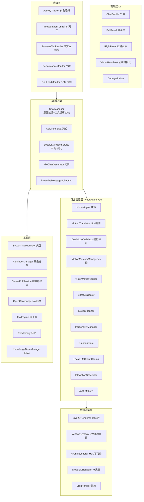

# 代码真相架构文档（Code-Truth Architecture）

> **审计方式**: 全部结论以 `code/desktop_unity/Assets/Scripts/` 下真实代码为准（2026-08-02 快照）
> **审计范围**: ~80 个 .cs 文件、约 33,000 行 C# 代码
> **重要声明**: 本项目的 md 文档（README / project_brief / 各类方案文档）**部分已过时**，存在多处与代码不符的陈述。本文档即为"唯一可信"的架构参照。
> **引擎**: 团结引擎 Tuanjie 2022.3.62t7（Unity 派生版）+ Live2D Cubism SDK 5-r.4

---

## 一、目录结构真相（非文档所述）

### 1.1 代码布局（真实）

```
code/desktop_unity/Assets/
├── Scripts/                          # 主控与系统层（33 个 .cs 顶层文件）
│   ├── Editor/                       # 编辑器工具（6 个，非运行时）
│   ├── Live2DFramework/              # Live2D 渲染/参数框架（10 个文件）
│   │   └── ActionAgent/              # 具身动作闭环（16 个文件）
│   └── ToolEngine/                   # 工具系统（10 个文件，52 个工具）
├── StreamingAssets/Live2D/Fuxuan/    # 符玄 Live2D 模型（唯一模型）
└── Resources/                        # 运行时资源
```

### 1.2 文件规模 TOP 榜（按行数）

| 文件 | 行数 | 职责 |
|---|---|---|
| `Live2DFramework/Live2DRenderer.cs` | **3,466** | Live2D 渲染、表情、天气联动（全项目最大） |
| `Editor/ParameterVisionScanner.cs` | 1,612 | 编辑器：参数视觉扫描 |
| `ChatManager.cs` | 1,351 | AI 对话、工具循环、意图过滤 |
| `Editor/VisualActionTester.cs` | 1,094 | 编辑器：视觉动作测试 |
| `DesktopPet.cs` | 1,080 | 主控制器、状态机 |
| `Live2DFramework/ActionAgent/MotionAgent.cs` | 1,043 | 动作决策智能体 |
| `Editor/SelfTrainingManager.cs` | 1,038 | 编辑器：自训练 |
| `Live2DFramework/ActionAgent/MotionTranslator.cs` | 871 | LLM 动作翻译器 |
| `Live2DFramework/ActionAgent/DualModelValidator.cs` | 802 | 视觉验证（实为单模型） |
| `ActivityTracker.cs` | 700 | 前台活动追踪 |

---

## 二、六层架构（以代码验证为准）

> 与 README 声称的六层架构大体吻合，但**各层内部组件数量与文档有出入**。



---

## 三、AI 核心层真相

### 3.1 ChatManager（1,351 行）— 与文档差异显著

| 项 | README 声称 | **代码实际** |
|---|---|---|
| 工具循环上限 | 5 轮 | **`MAX_TOOL_ROUNDS = 10`**（注释"5->10: 复杂任务需多轮"） |
| 历史裁剪 | — | **`MAX_HISTORY_ENTRIES = 60`** 条 |
| API 超时 | — | **看门狗 600s**（`REQUEST_TIMEOUT`，覆盖 GLM-4V 180s） |
| API 自动重试 | — | 最多 **3 次**，400/401/403 **不重试**（`ShouldRetry`） |
| 意图过滤 | — | **`IntentToolMap`**：chat/emotion 不发 tools；command/knowledge/operation 各配不同工具白名单 |
| 消息队列 | — | `_messageQueue` 等待时输入排队不丢 |
| 句子显示 | — | 流式 + 逐句队列（2.5s/句）、`SentenceVersionId` 供 ContextMenu 重播 |
| 反射（Reflect） | 声称驱动 | **`OnReflectRequest` 回调恒返回 null，反射实际未驱动** |

### 3.2 系统 Prompt 注入链（真实）

`BuildSystemPrompt()` 实际注入（按序）：
1. 基础人格（符玄人设）
2. `ActivityTracker.GetSummary()` 活动摘要
3. ★ 当前前台窗口（法眼实时观测）
4. ★ 多窗口环境摘要 `GetVisibleWindowsSummary()`
5. ★ 浏览器标签页深度感知 `GetBrowserTabsSummary()`
6. `InjectParameterKnowledge()` → **`ParameterKnowledgeProvider.GenerateKnowledgePrompt()`**（身体参数知识）
7. `InjectClosedLoopCapability()` → 闭环演武系统说明（GLM-4V 自评、演武心经、30 上限、无望淘汰）
8. `MotionMemoryManager.GetFormattedMemories()` 演武心经经验

### 3.3 本地 LLM 能力（LocalLLMAgentService）

4 项离线能力（Ollama，`qwen2.5:3b`，`http://127.0.0.1:11434`）：
- `ClassifyIntent` — 本地意图/情绪分类（异步，不阻塞对话流，写入 `_lastIntent` 供工具过滤）
- `GenerateFallbackReply` — API 挂时的兜底回复
- `SummarizeConversation` — 对话摘要
- `ExtractMemory` — 记忆提取

> ★ 注意：`LocalLLMClient.cs` 是**手写 JSON 构造**（非 Newtonsoft/JsonUtility），重试 2 次。

---

## 四、工具系统真相（ToolEngine）— 文档严重过时

### 4.1 文件清单（10 个文件，文档只列 6 个）

| 文件 | 内容 |
|---|---|
| `WebSystemTools.cs` | search_web / open_url / search / open_app / open_folder / get_system_info / lock_screen / set_volume / mute / get_mouse_pos / list_files |
| `ClipboardFileTools.cs` | get_clipboard / set_clipboard / get_weather / file_open / file_move / file_copy / file_delete / file_rename / file_info / file_create / search_files / search_file / notify / power |
| `ReminderAcademicTools.cs` | set_reminder / query_reminders / mark_reminder_done / delete_reminder / query_exams / query_scores / query_schedule / query_user_status |
| `Live2DSyncTools.cs` | set_expression / play_action / stop_action / inspect_motion_memory / inspect_personality / explore_body / control_body |
| `VisionKnowledgeTools.cs` | take_screenshot / knowledge_search / knowledge_index / openclaw_search |
| `MotionCoroutineTools.cs` | generate_motion / explore_body_vision / run_verification / vis_verify / self_review |
| `PoggetTool.cs` ★文档未列 | **launch_pogget** → 启动 `d:\pogget\Pogget.exe` |
| `PoggetAgentTool.cs` ★文档未列 | **pogget_agent** → IPC 调 `D:\pogget\agent\bin\PoggetAgent-debug.exe`（7 个子命令） |
| `LatexCompileTool.cs` ★文档未列 | **compile_latex** → OpenClawBridge.CompileLatexAsync，输出 `D:\DesktopPetData\Documents\` |
| `ToolSchema.cs` ★文档未列 | JSON Schema 构建器 |
| `AsyncToolBase.cs` ★文档未列 | 异步工具基类 |

> **合计：52 个已注册工具**（README 未提及 Pogget、LaTeX 等新工具）。

### 4.2 意图 → 工具白名单映射（真实）

- **chat** / **emotion** → 不发任何 tools（纯角色对话）
- **command** → launch_pogget、pogget_agent、open_app、open_url、open_folder、search、search_web、openclaw_search、lock_screen、set_volume、mute、power、get_system_info、get_mouse_pos、list_files、run_command、notify、get_clipboard、set_clipboard、file_*、take_screenshot
- **knowledge** → search_web、search、openclaw_search、knowledge_search、compile_latex、get_weather、query_*、inspect_*、explore_body*
- **operation** → set_expression、play_action、stop_action、generate_motion、inspect_*、explore_body*、take_screenshot、knowledge_index

---

## 五、具身智能层（ActionAgent，16 个文件）真相

> README 声称"15 组件 / 15 文件"——**实际 16 个文件**。详见子代理审计。

### 5.1 MotionAgent 决策循环（已核实与文档一致）

```
等待 → ShouldDecide() → GatherContext() → DecideWithLLM() / FallbackDecide()
     → ExecuteDecision() → 播放动作 → 回到等待
```

- **密度分级**：High = `max(base×0.5, 4s)` / Med = base / Low = `min(base×2, 15s)` / Sleep = 30s
- **截图采样点**：{0.20, 0.40, 0.60, 0.80}，拼 2×2 拼图

### 5.2 已确认 Bug（代码真相审计核心产出）

| # | 位置 | 问题 | 影响 |
|---|---|---|---|
| **BUG-1** | `MotionAgent.cs` L369 | **`IsSleepTime()` 硬编码 `return false`**（debug 跳过注释未删） | 睡眠时段密度永远不触发 |
| **BUG-2** | `MotionAgent.cs` | `ExecuteMotion` 在播放**前**加 AI 锁（L985），`ExecuteCombo` 在播放**后**加锁（L1062） | 锁序不一致，连招期间 AI 可能插话 |
| **BUG-3** | `MotionAgent.cs` | `GatherContext()` 注释声称农历→月相，实际用 `now.Day`（公历） | 月相感知名不符实 |
| **BUG-4** | `ActivityTracker.cs` | `UpdateInteractionTime()` 分支为空实现 | 交互时间未更新 |
| **BUG-5** | `DualModelValidator.cs` | **名为"Dual"实为单 GLM-4V**（Qwen-VL 已移除，qwenScore/review 恒 0） | 双模型校验名存实亡 |
| **BUG-6** | `AutoMotionCollector.cs` | `[Obsolete]` 死代码 331 行（已被 MotionAgent+DualModelValidator 取代但未删） | 维护负担 |
| **BUG-7** | `MotionTranslator.cs` | 示例（L242-256）用 `arm_right_upper: 0.8`，与规则"15-25 度"矛盾 | 可能误导 LLM 输出 |
| **BUG-8** | `MotionTranslator.cs` | README 称"11 规则+12 特殊模式"，**实际 10 规则 + 10 特殊模式（9 种姿势，捂脸重复）** | 文档错误 |
| **BUG-9** | `MotionPlanner.cs` | README 称曲线含 "BounceEaseOut"，实际为 `Bounce` | 文档错误 |

> **修复状态（N39, 2026-08-02）**：BUG-1~BUG-7 已在代码中修复（详见 `CHANGELOG.md` N39 条目），`build.ps1 -Quick` 编译验证通过。
> BUG-8/BUG-9 为纯文档错误，已随 N38 文档重写修正。
> **审计澄清**：#9（反思）与 #8（知识库）在修复前即已通过其他路径接线——
> 反思：`ChatManager.SendRequestCoroutine → CheckReflection → DoReflection → CommitReflection`（DeepSeek 提炼）；
> 知识库：`BackgroundKnowledgeSearch → SearchAndFormat → _cachedKnowledgeContext → SystemPrompt 注入`。
> 遗留的 `OnReflectRequest` 死字段与 `GetFormattedContext()` 恒空 STUB 已清理（删除字段 / 改为返回 `LastFormattedContext` 缓存）。

### 5.3 真实组件行为

| 组件 | 真相 |
|---|---|
| `MotionMemoryManager` | 30 条上限、负面 ≤10、冷却 120s、≥5 次尝试且最佳 ≤2 → 无望淘汰；`GetFailurePenalty`（≤2→0.3 / 近3次均值≤2.0→0.4 / ≤2.5→0.7）；11 个中文名映射；存储 `motion_memory.json` |
| `MotionPlanner` | 静态类；**10 个硬编码动作模板** + 6 表情模板 + 6 曲线 |
| `PersonalityManager` | 五维特质（勤奋0.5/温暖0.6/活泼0.5/自信0.5/好奇0.6）+ 三维关系（信任0.3/亲密0.2/熟悉0.1）；learningRate=0.01；drift 0.002/帧；**`DriftTowardNeutral` 在 ActionAgent 目录内无调用者** |
| `VisionMotionVerifier` | 静态；10 个视觉测试；先 MotionPlanner 后 LLM fallback；55% 进度截图；GLM 超时 180s；**用付费 GlmVisionModel（无余额降级）** |
| `SafetyValidator` | 2 个互斥组、5 对对称肢体、极端值警告 |
| `EmotionState` | valence/arousal/warmth/energy；120s 半衰期衰减；7 种主导情绪 |
| `MotionVerifier`（非视觉） | 静态同步、**无 LLM**；5 控制 + 10 测试 + 4 边界；`SYMMETRY_PAIRS` 10 对 |
| `MotionGenerator` | 非 MonoBehaviour；Mathf.Lerp 插值；插入零帧 |
| `IdleActionScheduler` | JSON 配置驱动；硬编码天气权重（夜晚微笑×0.3 / 雨哭×1.8 / 雪微笑×1.5） |
| `GpuLoadMonitor` | 游戏分类 → `LocalLLMClient.Paused = true`，30s 冷却 |
| `AutoMotionCollector` | ★ [Obsolete] 死代码 |

---

## 六、感知 / 记忆 / 窗口系统真相（33 文件审计）

### 6.1 文档声称存在但代码不符/缺失（8 项）

| 文档声称 | 代码真相 |
|---|---|
| `KnowledgeBaseManager.GetFormattedContext()` 提供同步上下文 | **是 STUB，恒返回 ""**（缓存不存在，RAG 只在知识检索时用） |
| `ChatManager.OnReflectRequest` 驱动反思 | **回调恒 null，反思未实际驱动** |
| `HybridRenderer` 3D 模式可用 | **3D 模式不可用** — TODO 注释，强制走 Live2D |
| `Model3DRenderer` 绿幕抠像（Color Key） | **实际设置纯黑背景**，注释与代码矛盾 |
| `VisualHeartbeat` 默认表情 "curious" | **实际默认 "surprise"** |
| README "36 个核心脚本" | **实际顶层 33 + 子目录 ~50** |
| `PerformanceMonitor.GetResolutionScale()` 动态降分辨率 | **恒返回 1.0f**（仅帧率降级） |
| `WindowOverlay.isMultiMonitor` 支持多屏 | **恒为 false**（只用 `SM_CXSCREEN`，多屏逻辑死代码） |

### 6.2 真实实现（已核实存在且可用）

| 系统 | 真相 |
|---|---|
| `ReminderManager` | **三级推送真实**：气泡 → PowerShell-WinRT Toast（AppId '符玄'）→ Server酱³（`https://sctapi.ft07.com/send/{key}`）；存 `reminders.json` |
| `ServerPollService` | localhost:3000；Bearer token（Inspector→`DESKTOP_TOKEN`→fallback）；考试提醒：前 3 天 19:00 + 考前 2h |
| `ActivityTracker` | 2s 轮询；8 类关键词匹配（coding/gaming/studying/browsing/entertainment/communication/idle/other）；30 天留存 `activity_log.json` |
| `TimeWeatherController` | **默认天气源 wttr.in（cityCode="Nanjing"）**，QWeather 可选；DeepSeek 生成 6 行天气文案；天气→表情联动在 `Live2DRenderer.Update()` 消费 |
| `PetMemory` | 存储 3 层（entries+coreFacts+conversationSummary），但 `GetFormattedMemories()` **输出 4 层**（核心事实→【近日印象】→Top5重要→最近3条） |
| `KnowledgeBaseManager` | 真实 RAG：Ollama `/api/embed` + nomic-embed-text + 余弦 TopK；存 `knowledge_base.json` |
| `VisualHeartbeat` | GDI `StretchBlt` 8×6 网格 |
| `AutoChat` | 监听 `DragHandler.OnPetClicked/OnDragEnded` → `*戳额头*`；混淆关键词 → `ForceAction("confuse")` |
| `ChatBubble` | 消息优先级 Low/Normal/High，高优先抢占 |
| `RightPanel` | `~` 键（BackQuote）打开；**含 Pogget 启动按钮** |
| `DragHandler` | 5 帧投掷缓冲；`eyeFollowDistance = 150` |
| `SystemTrayManager` | `Shell_NotifyIcon` + `HKCU\Run` 自启 |
| `MainThreadDispatcher` | ConcurrentQueue |
| `ChatConfig.cs` | 仅环境变量，**提供 .cs.example 模板**（防泄漏） |
| `ApiClient.cs` | SSE 流式 |
| `IdleChatGenerator` | 批量 `\|\|\|` 拼接；minCacheSize=4 / batchSize=10 / 冷却 180f |
| `ProactiveMessageScheduler` | 零 LLM 规则：编码 90min / 23:00 深夜 / 12、18 点用餐 / 游戏 120min |
| `GpuLoadMonitor` | 见 5.3 |

### 6.3 OpenClawBridge（Node.js，`openclaw_bridge.js`）

- HTTP 端口 **19876**：`/search`、`/health`、`/compile_latex`
- WebSocket 网关：`ws://127.0.0.1:18789`
- 认证：Bearer token
- 会话 key：`agent:main:main`
- 消费方：`OpenClawBridge.cs`（C# 侧）+ `LatexCompileTool` + `VisionKnowledgeTools.openclaw_search`

---

## 七、数据持久化真相

> 根目录硬编码在 `DataPathConfig.cs`：**`D:\DesktopPetData\`**

| 文件 | 写入方 | 说明 |
|---|---|---|
| `pet_config.json` | PetConfig | 宠物配置 |
| `pet_memory.json` | PetMemory | 记忆（3 层结构） |
| `reminders.json` | ReminderManager | 提醒 |
| `motion_memory.json` | MotionMemoryManager | 演武心经（30 条上限） |
| `pet_personality.json` | PersonalityManager | 人格五维 |
| `activity_log.json` | ActivityTracker | 30 天活动日志 |
| `knowledge_base.json` | KnowledgeBaseManager | RAG 知识库 |
| `Documents/` | LatexCompileTool | LaTeX 编译输出 |
| `ActionRefs/` | ActionReferenceManager | 参考图（512×512 PNG 仅注释） |
| `glm_collages/` | DualModelValidator | 2×2 拼图（上限 50 张） |

---

## 八、构建与测试真相

| 项 | 真相 |
|---|---|
| 构建入口 | `Editor/BuildScript.cs`：`BuildDesktopPet()` / `VerifyCompile()` |
| 构建脚本 | `build.ps1`（`-Quick` / `-RunTests` / `-OutputDir`） |
| 构建产物 | `Build\DesktopPet.exe` |
| 引擎 | Tuanjie 2022.3.62t7（团结引擎）；**路径拼接 bug：需 `cd` 到项目目录 + `-projectPath .`** |
| 单元测试 | `build_test_results.xml` 存在（Unity Test Framework）；注意 `Debug.LogError/Warning` 会被计为失败，需 `LogAssert.Expect` |

---

## 九、文档 vs 代码偏差总表（核心交付物）

| # | 文档陈述 | 代码真相 | 严重度 |
|---|---|---|---|
| 1 | README 工具循环 5 轮 | `MAX_TOOL_ROUNDS=10` | 高 |
| 2 | ToolEngine 6 文件 | 10 文件 + 52 工具（Pogget/LaTeX/Schema/AsyncBase 未列） | 高 |
| 3 | ActionAgent 15 组件 | 16 文件 | 低 |
| 4 | "11 规则 + 12 特殊模式" | 10 规则 + 10 特殊（9 姿势） | 中 |
| 5 | 曲线含 "BounceEaseOut" | `Bounce` | 低 |
| 6 | 双模型校验（Qwen+GLM） | 单 GLM-4V（Qwen 已删） | 高 |
| 7 | 36 个核心脚本 | 顶层 33 + 子目录 ~50 | 中 |
| 8 | 知识库同步上下文 | `GetFormattedContext()` 是 STUB | 高 |
| 9 | 反思机制驱动 | `OnReflectRequest` 恒 null | 高 |
| 10 | 3D 渲染可用 | HybridRenderer TODO，强制 Live2D | 中 |
| 11 | 绿幕抠像 | 纯黑背景 | 低 |
| 12 | 多屏支持 | `isMultiMonitor` 恒 false | 中 |
| 13 | 动态分辨率降级 | `GetResolutionScale` 恒 1.0 | 低 |
| 14 | 默认表情 curious | 默认 surprise | 低 |
| 15 | 天气来源（文档/记忆称 QWeather 主） | 默认 wttr.in，QWeather 可选 | 中 |
| 16 | AutoMotionCollector 活动采集 | [Obsolete] 死代码 331 行 | 中 |

---

## 十、结论与建议

### 可信的架构骨架
六层架构、闭环演武（生成→摄形→GLM 自评→心经强化）、意图过滤工具系统、三级提醒、RAG 知识库、OpenClaw 桥接、Pogget/LaTeX 集成——**这些都是真实存在且可用的**。

### 最需要优先修复的 5 件事
1. **BUG-1**：`IsSleepTime()` 恒 false → 睡眠调度失效
2. **BUG-2**：`ExecuteCombo` 锁序错误 → 连招期间 AI 可能插话
3. **#9**：反思机制未接线（OnReflectRequest 恒 null）
4. **#8**：知识库同步上下文 STUB
5. **BUG-5**：DualModelValidator 名不副实（改名或补回 Qwen）

### 建议
- 以本文档为基准更新 README / project_brief 中的过时章节
- 清理死代码（AutoMotionCollector）、修正注释与代码矛盾（Model3DRenderer、VisualHeartbeat）
- 多屏支持（isMultiMonitor）与 3D 模式为规划中能力，勿在文档中宣称可用
